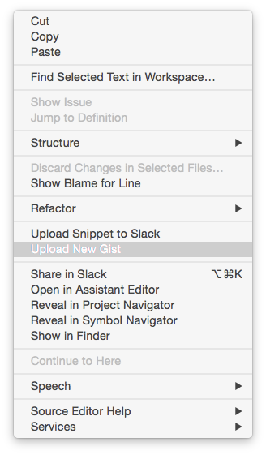
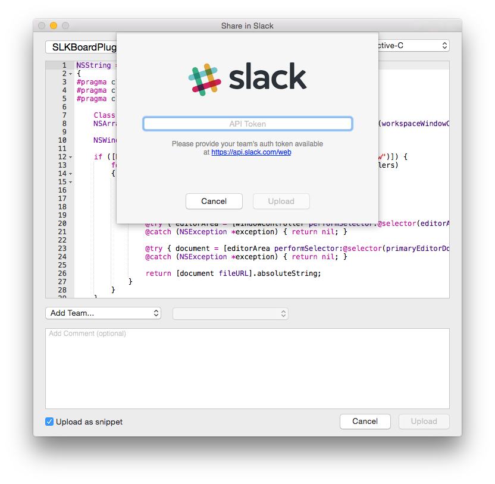
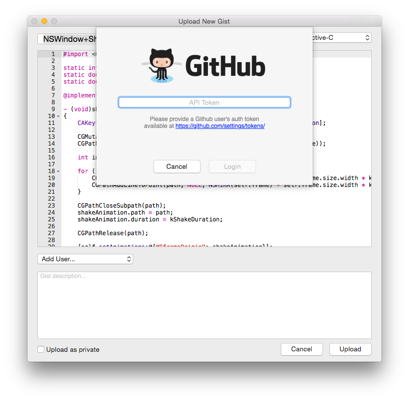
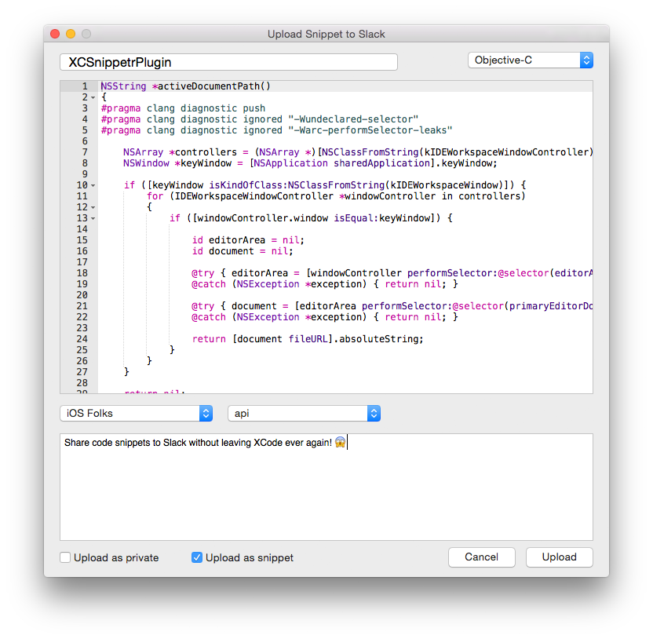

#XCSnippetr

Share code snippets to Slack and Gist without leaving XCode ever again! 😱

## Features

- Upload code snippets using Slack's and Github's APIs.
- The plugin is available from the code editor's contextual menu.
- Extremely easy to sign-in using your API tokens. Your tokens are secure 🙈, stored in the system's Keychain.
- Add an initial comment (optional).
- Code syntax highlight, thanks to [ACEView](https://github.com/faceleg/ACEView) 👏.
- Auto-detection of the source file name, used as the snippet title by default.
- Auto-detection of the source code type. No Swift support for now 😔.

Slack only:
- Share to any of your teams, channels, groups and users.
- Upload as a file snippet or as a message with fenced code block.
- Upload as a private file or private message to Slackbot.
- Team's channels are cached during your XCode session.
- Add as many teams as you want.

Gist only:
- Upload private gists

## Configuration

Select any code snippet you would like to share and right click on it.

The first time, you will be prompt to authenticate.

For Slack, use your API tokens available at https://api.slack.com/web

For Gist, generate API tokens at [https://github.com/settings/tokens/](https://github.com/settings/tokens/new?description=xcsnippetr&scopes=gist)

You should be ready to go now.
Simply pick the team and channel to share to. Add a comment. Share! 💥

## Install

Install through [Alcatraz](http://alcatraz.io/), the package manager for Xcode.

Alternatively, clone the project:

1. Run `pod update` to install the dependencies.

2. Build the project to install the plugin. The plugin is installed in `/Library/Application Support/Developer/Shared/Xcode/Plug-ins/XCSnippetr.xcplugin`.

2. Restart Xcode so the plugin bundle is loaded.

